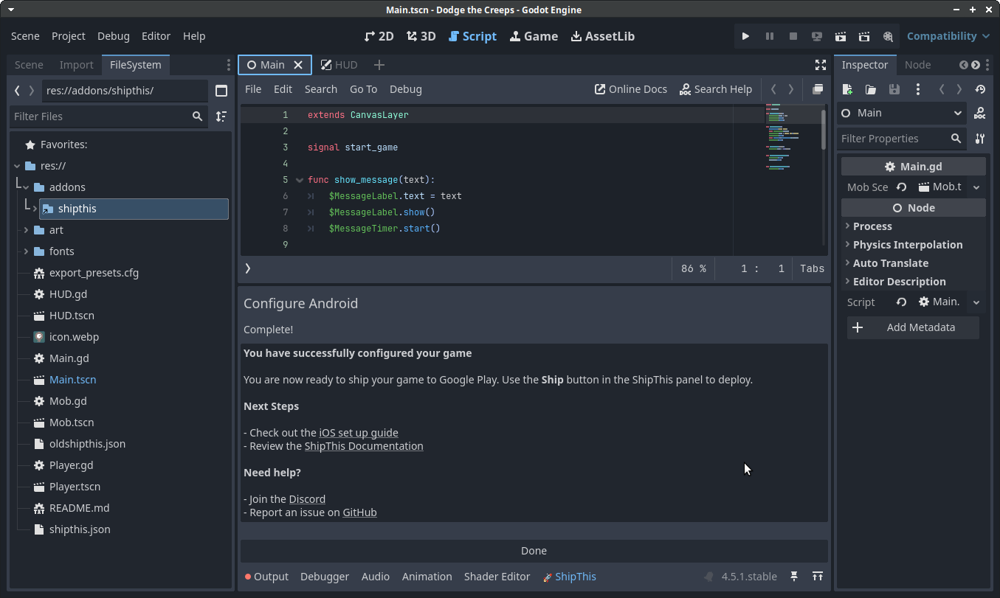

# ShipThis Godot Editor Addon 

Godot editor addon to build and publish iOS and Android games using [ShipThis](https://github.com/shipth-is/cli) from within the Godot Editor.

## Goals

- [x] Authentication - https://github.com/shipth-is/godot-addon/pull/2
- [X] Trigger a build - https://github.com/shipth-is/godot-addon/pull/5
- [X] Show the build output - https://github.com/shipth-is/godot-addon/pull/8
- [X] Setup an Android game - https://github.com/shipth-is/godot-addon/issues/7
- [ ] Improve UI
- [ ] Setup an iOS game